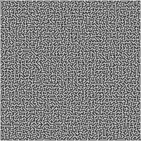
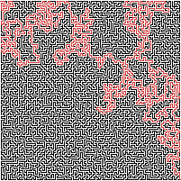
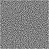
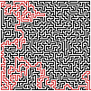

# Pathfinding test with visual representation

This is a simple pathfinding test using the both "keep the right" algorithm and the depth-first search algorithm.

The maze is represented by a png, the white pixels are walls and the black pixels are paths.

Almost all the mazes were generated with Kees Meijer maze generator found at https://keesiemeijer.github.io/maze-generator/.

## Maze examples

### Fully connected maze without removing walls

 

 

### Maze with removed walls

 

## Example output

### Fully connected maze without removing walls
 

 

 

 

### Maze with removed walls
 

# example with goal in the center

## How to run
In the Path_find_depth_first.py and Path_find_keep_right.py files you can change the filename or specify a given list with a start and a goal. The interval between snapshots can also be changed.

## Requirements
- Python 3 (3.10.1 used)
- Numpy
- matplotlib
- FFmpeg (for video creation)
